# Final Project Report — WordPress HA + S3 on AWS

**Course:** Cloud Computing & AWS  
**Project:** Semester Final — HA WordPress with S3 Media Offload & CloudWatch Monitoring  
**Repository:** https://github.com/hahyunnii/final-project-wordpress-ha (branch: `final-project`)  
**url:** http://wp-final-alb-1657988911.us-east-1.elb.amazonaws.com/
**Due Date:** June 20, 2026  

---

## 1. Objective

본 프로젝트는 수업 전체(Week 1~12)에서 다룬 AWS 핵심 개념들을 하나의 실제 동작하는 서비스로 통합 구현하는 것을 목표로 한다.

교수님의 제안("extend WordPress in a way that supports scalability or high availability")에 따라 Assignment 6(EC2 + RDS + ALB + ASG)을 베이스라인으로 삼아 **S3 미디어 Offload**와 **CloudWatch 통합 모니터링**, **ab 벤치마크 테스트**를 추가하여 수업의 모든 토픽을 하나의 시스템에 연결하였다.

---

## 2. Concepts Covered from Class

교수님이 언급한 수업 토픽 전체를 본 프로젝트에서 다음과 같이 적용하였다.

| Week | 수업 주제 | 프로젝트 적용 |
|---|---|---|
| 1 | Cloud 개념, IaaS/PaaS/SaaS, Scale-out vs Scale-up | Multi-AZ HA 설계 근거, ASG 수평 확장 |
| 2 | VPC, Security Groups, IAM (Role/Policy/Instance Profile) | 3계층 SG 체인, LabRole로 EC2→S3 인증 |
| 3~4 | S3 Static Hosting, Bucket Policy, 접근 제어 | S3 미디어 버킷, Public Read Policy, CORS 설정 |
| 5~6 | EC2 + ALB 구성, AWS CLI | ALB 트래픽 분산, CLI 기반 인프라 검증 |
| 7 | Terraform IaC — init/plan/apply/destroy | 25개 리소스 전체 코드화, 재현 가능한 배포 |
| 8 | Benchmarking (ab) — Baseline vs Load test | C=10/N=100 베이스라인, C=40/N=500 부하 테스트 |
| 9~10 | CloudWatch Metrics, Alarms, Auto Scaling | Dashboard 7위젯, CPU 알람, ASG 자동 확장 |
| 11~12 | RDS MySQL, Multi-AZ, publicly_accessible | RDS MySQL 8.0 Multi-AZ, SG-only 접근 |

---

## 3. Architecture

```
Internet
   │ HTTP/80
   ▼
┌─────────────────────────────────────────┐
│  Application Load Balancer              │
│  wp-final-alb                           │
│  wp-final-alb-1657988911                │  sg-alb: 0.0.0.0/0 → TCP/80
│  .us-east-1.elb.amazonaws.com           │  가용 영역: us-east-1a, us-east-1b
└──────────────────┬──────────────────────┘
                   │ HTTP/80 (alb-sg → wordpress-sg only)
        ┌──────────┼──────────┐
        ▼                     ▼
┌───────────────┐    ┌───────────────┐
│ EC2           │    │ EC2           │  Auto Scaling Group: wp-final-asg
│ us-east-1a    │    │ us-east-1b    │  min=1, desired=2, max=3
│ t3.micro      │    │ t3.micro      │  sg-wordpress (alb-sg → 80 only)
│ WordPress     │    │ WordPress     │  IAM Role: LabRole (S3 접근)
│ Apache + PHP  │    │ Apache + PHP  │
└───────┬───────┘    └───────┬───────┘
        └──────────┬──────────┘
                   │ MySQL/3306 (wordpress-sg → rds-sg only)
                   ▼
┌─────────────────────────────────────────┐
│  RDS MySQL 8.0 Multi-AZ                 │
│  wp-final-mysql                         │  sg-rds: wordpress-sg → 3306 only
│  Primary:  us-east-1a                   │  publicly_accessible = false
│  Standby:  us-east-1b (자동 Failover)  │
└─────────────────────────────────────────┘

┌─────────────────────────────────────────┐
│  S3 Bucket: wp-final-media-980808829165 │
│  WP Offload Media Lite (Plugin)         │  WordPress 미디어 자동 Offload
│  IAM Role 인증 (Access Key 불필요)      │  원본 + 썸네일 자동 저장
│  Public Read 허용                       │  S3 URL로 직접 서빙
└─────────────────────────────────────────┘

┌─────────────────────────────────────────┐
│  CloudWatch Dashboard: wp-final-dashboard│
│  7개 위젯 실시간 모니터링               │
│  EC2 / ALB / ASG / RDS / S3            │
└─────────────────────────────────────────┘
```

---

## 4. What's New vs. Assignment 6

Assignment 6에서 구현한 EC2 + RDS + ALB + ASG 베이스라인에서 다음 3가지를 추가하였다.

| 항목 | Assignment 6 | Final Project |
|---|---|---|
| 미디어 저장소 | EC2 로컬 디스크 | **S3 버킷 (자동 Offload)** |
| EC2 Stateless 여부 | ❌ 미디어 로컬 저장 | ✅ 미디어 완전 S3 이전 |
| IAM Role | 없음 | **LabRole (EC2→S3 인증)** |
| CloudWatch | EC2 CPU 알람 2개 | **Dashboard 7위젯 + RDS 알람 2개 추가** |
| Benchmarking | 없음 | **ab 부하 테스트 + CloudWatch 연계 검증** |
| 총 Terraform 리소스 | 14개 | **25개** |
| 수업 개념 커버리지 | Week 5~12 | **Week 1~12 전체** |

특히 Assignment 6의 PDF 자료에서 명시적으로 "미해결 문제(What This Lab Still Does NOT Solve)"로 언급된 **공유 파일 스토리지(Shared File Storage)** 문제를 S3 Offload로 해결하였다.

---

## 5. Resources Created (25개)

| # | Terraform Resource | AWS Name | 역할 |
|---|---|---|---|
| 1 | `aws_s3_bucket` | `wp-final-media-980808829165` | 미디어 파일 저장소 |
| 2 | `aws_s3_bucket_public_access_block` | — | Public 접근 허용 |
| 3 | `aws_s3_bucket_ownership_controls` | — | BucketOwnerPreferred |
| 4 | `aws_s3_bucket_policy` | — | Public Read GetObject |
| 5 | `aws_s3_bucket_cors_configuration` | — | CORS GET/HEAD 허용 |
| 6 | `aws_security_group.alb` | `sg-0547e2f86c9fd0ff8` | ALB 공개 HTTP/80 |
| 7 | `aws_security_group.wordpress` | `sg-0df92ea4c5d4e45d1` | EC2 alb-sg→80 only |
| 8 | `aws_security_group.rds` | `sg-04a8c592eafad89b8` | RDS wp-sg→3306 only |
| 9 | `aws_db_subnet_group` | `wp-final-db-subnets` | RDS 서브넷 그룹 |
| 10 | `aws_db_instance` | `wp-final-mysql` | MySQL 8.0 Multi-AZ |
| 11 | `aws_lb` | `wp-final-alb` | Application Load Balancer |
| 12 | `aws_lb_target_group` | `wp-final-tg` | /health.html 헬스체크 |
| 13 | `aws_lb_listener` | — | HTTP/80 → TG 포워딩 |
| 14 | `aws_launch_template` | `lt-079d260e6f4841c88` | EC2 설정 + user_data |
| 15 | `aws_autoscaling_group` | `wp-final-asg` | min=1 desired=2 max=3 |
| 16 | `aws_autoscaling_policy.scale_out` | `wp-final-scale-out` | CPU>70% → +1 인스턴스 |
| 17 | `aws_autoscaling_policy.scale_in` | `wp-final-scale-in` | CPU<30% → -1 인스턴스 |
| 18 | `aws_cloudwatch_metric_alarm.cpu_high` | `wp-final-cpu-high` | EC2 scale-out 트리거 |
| 19 | `aws_cloudwatch_metric_alarm.cpu_low` | `wp-final-cpu-low` | EC2 scale-in 트리거 |
| 20 | `aws_cloudwatch_metric_alarm.rds_cpu_high` | `wp-final-rds-cpu-high` | RDS CPU>80% 경보 |
| 21 | `aws_cloudwatch_metric_alarm.rds_storage_low` | `wp-final-rds-storage-low` | RDS 스토리지<2GiB 경보 |
| 22 | `aws_cloudwatch_dashboard` | `wp-final-dashboard` | 통합 모니터링 대시보드 |
| 23~25 | data sources | LabRole, LabInstanceProfile, AMI 등 | 기존 리소스 참조 |

---

## 6. Key Design Decisions

### 6.1 S3 미디어 Offload — EC2 Stateless 달성

**문제:**
WordPress 미디어 파일이 EC2 로컬 디스크(`/var/www/html/wp-content/uploads/`)에 저장되면 ASG 환경에서 두 가지 문제가 발생한다.

1. 인스턴스가 교체되면 업로드된 파일이 손실됨
2. 2개 EC2 인스턴스가 파일을 공유하지 않아 ALB 라우팅에 따라 파일이 없는 인스턴스에 요청이 가는 경우 발생

**해결:**
WP Offload Media Lite 플러그인을 설치하여 미디어 업로드 시 S3에 자동 복사. IAM Role(LabRole)로 Access Key 없이 인증.

**결과:**
- 미디어 URL이 EC2 도메인 → S3 도메인으로 변경
- EC2는 PHP/Apache 코드만 실행하는 완전한 stateless 상태 달성
- ASG가 인스턴스를 교체해도 S3의 미디어 파일 유지
- 업로드 이미지의 원본 + 썸네일(150x150, 300x257)이 S3에 자동 저장됨

**S3 URL 구조:**
```
http://wp-final-media-980808829165.s3.amazonaws.com/
  wp-content/uploads/2026/06/[timestamp]/[filename].png
```

### 6.2 IAM Role 기반 S3 인증

Access Key를 코드나 설정 파일에 노출하지 않고, EC2에 IAM Role(LabRole)을 Instance Profile로 연결. EC2가 S3에 접근할 때 AWS STS가 임시 자격증명을 자동 발급한다.

```
EC2 Instance → LabRole (Instance Profile)
→ AWS STS 임시 자격증명 자동 발급
→ S3 PutObject / GetObject / DeleteObject 권한
```

AWS Academy 환경에서는 `iam:CreateRole` 권한이 없어, 새 Role 생성 대신 기존 LabRole을 Terraform `data source`로 참조하였다.

```hcl
data "aws_iam_role" "lab_role" {
  name = "LabRole"
}
data "aws_iam_instance_profile" "lab_instance_profile" {
  name = "LabInstanceProfile"
}
```

### 6.3 Security Group 3계층 체인

각 레이어가 바로 상위 SG만 신뢰하는 최소 권한 원칙을 적용하였다.

```
인터넷 → alb-sg   (TCP/80, 0.0.0.0/0)
       → wp-sg    (TCP/80, alb-sg만 허용)
       → rds-sg   (TCP/3306, wp-sg만 허용)
```

RDS는 `publicly_accessible = false`와 SG 제한으로 이중 보호된다. `rds-sg`의 `IpRanges`는 비어있어 어떤 CIDR에서도 직접 접근 불가하다.

### 6.4 CloudWatch Dashboard

수업 Week 8(Benchmarking)과 Week 9~10(CloudWatch)에서 배운 내용을 연결하여 "벤치마크 결과 → CloudWatch 메트릭 연계"를 실제로 구현하였다.

**Dashboard 위젯 구성:**

| 위젯 | 메트릭 | 목적 |
|---|---|---|
| EC2 CPU Utilization | `CPUUtilization` (ASG) | Scale-out/in threshold 시각화 |
| ALB Request Count & Response Time | `RequestCount`, `TargetResponseTime` | 트래픽 부하 및 응답시간 추적 |
| ASG Instance Count | `GroupDesiredCapacity`, `GroupInServiceInstances` | 인스턴스 수 변화 모니터링 |
| RDS CPU & DB Connections | `CPUUtilization`, `DatabaseConnections` | DB 부하 추적 |
| RDS Free Storage Space | `FreeStorageSpace` | 스토리지 잔량 모니터링 |
| ALB Healthy Host Count | `HealthyHostCount` | 정상 인스턴스 수 확인 |
| S3 Object Count & Size | `NumberOfObjects`, `BucketSizeBytes` | 미디어 파일 증가 추세 |

---

## 7. Benchmark Results

### 7.1 Test Configuration

```bash
# 베이스라인
ab -n 100 -c 10 http://wp-final-alb-1657988911.us-east-1.elb.amazonaws.com/

# 부하 테스트
ab -n 500 -c 40 http://wp-final-alb-1657988911.us-east-1.elb.amazonaws.com/
```

### 7.2 Results

| Metric | Baseline (C=10, N=100) | Load Test (C=40, N=500) | 변화 |
|---|---|---|---|
| Requests/sec | 19.65 | 22.15 | +12.7% |
| 평균 응답시간 | 508 ms | 1,805 ms | +255% |
| p95 응답시간 | 650 ms | 2,282 ms | +251% |
| p99 응답시간 | 711 ms | 2,562 ms | +260% |
| **Failed requests** | **0** | **0** | **0%** |
| Transfer rate | 1,348 KB/s | 1,519 KB/s | +12.7% |

### 7.3 Interpretation

**안정성 — Failed requests: 0**
C=40의 높은 동시성에서도 500건 전체 요청이 성공. ALB가 2개 EC2 인스턴스에 부하를 분산하여 단일 인스턴스 대비 안정적인 처리 유지.

**응답시간 증가**
C=40에서 평균 응답시간이 508ms → 1,805ms로 증가. WordPress는 PHP 렌더링 + RDS 쿼리를 동반하므로 동시 요청 증가 시 처리 큐가 쌓임. t3.micro 2개 기준 용량 한계에 근접한 상태이며, CPU 알람 임계값(70%)에 도달하면 ASG scale-out 정책이 자동으로 인스턴스를 추가하여 대응 가능.

**CloudWatch 연계**
벤치마크 실행 중 `wp-final-dashboard`에서 ALB RequestCount 스파이크와 TargetResponseTime 증가가 실시간으로 반영됨을 확인. Week 8에서 배운 "Benchmark Output → CloudWatch Metric → Operational Decision" 흐름을 실제로 검증.

---

## 8. Deployment Evidence

### 8.1 실제 리소스 값

| Resource | Value |
|---|---|
| Account ID | `980808829165` |
| Region | `us-east-1` |
| VPC | `vpc-099a13dbc423e5700` |
| ALB DNS | `wp-final-alb-1657988911.us-east-1.elb.amazonaws.com` |
| ALB ARN | `arn:aws:elasticloadbalancing:us-east-1:980808829165:loadbalancer/app/wp-final-alb/7834b39e8b86d1e3` |
| EC2 (AZ-a) | `i-07b33d926afe269c8` / `44.211.183.147` / `us-east-1a` |
| EC2 (AZ-b) | `i-0155d46e46d7633b4` / `34.239.103.143` / `us-east-1b` |
| Launch Template | `lt-079d260e6f4841c88` |
| RDS Identifier | `wp-final-mysql` |
| RDS Endpoint | `wp-final-mysql.cdc6m8c42ir8.us-east-1.rds.amazonaws.com:3306` |
| RDS Multi-AZ | `true` (Standby: us-east-1b) |
| RDS Publicly Accessible | `false` |
| S3 Bucket | `wp-final-media-980808829165` |
| S3 URL Base | `https://wp-final-media-980808829165.s3.us-east-1.amazonaws.com` |
| IAM Role | `LabRole` |
| CloudWatch Dashboard | `wp-final-dashboard` |

### 8.2 Security Boundary

| SG | ID | Inbound Rule |
|---|---|---|
| alb-sg | `sg-0547e2f86c9fd0ff8` | TCP/80 from `0.0.0.0/0` |
| wordpress-sg | `sg-0df92ea4c5d4e45d1` | TCP/80 from `sg-0547e2f86c9fd0ff8` only |
| rds-sg | `sg-04a8c592eafad89b8` | TCP/3306 from `sg-0df92ea4c5d4e45d1` only |

### 8.3 Connectivity Verification

| Check | Command | Result |
|---|---|---|
| EC2 Bootstrap | `curl health_check_url` | `ok` (s3_bucket 정보 포함) |
| PHP → RDS | `curl db_check_url` | `db-ok` |
| EC2 → S3 (IAM Role) | `aws s3 cp test s3://...` | 업로드 성공 |
| S3 Media Offload | WordPress 미디어 업로드 | S3 URL(`s3.amazonaws.com`)로 서빙 확인 |
| ALB Target | Target Group 대상 탭 | `Healthy` |
| RDS Multi-AZ | `aws rds describe-db-instances` | `MultiAZ: true`, `Public: false` |

### 8.4 S3 Offload 실증

WordPress 미디어 업로드 후 S3에서 파일 확인:

```
$ aws s3 ls s3://wp-final-media-980808829165 --recursive

2026-06-19 21:55:55  65395  wp-content/uploads/2026/06/20045554/스크린샷.png
2026-06-19 21:55:55  12188  wp-content/uploads/2026/06/20045554/스크린샷-150x150.png
2026-06-19 21:55:55  30493  wp-content/uploads/2026/06/20045554/스크린샷-300x257.png
```

- 원본 + 썸네일 2종이 S3에 자동 저장됨
- WordPress Admin → Media Library에서 확인한 파일 정보:
  - Storage Provider: **Amazon S3**
  - Bucket: **wp-final-media-980808829165**
  - Region: **US East (N. Virginia)**
  - File URL: `http://wp-final-media-980808829165.s3.amazonaws.com/...`
  - Access: **Public**

### 8.5 Screenshots

**WordPress Admin Dashboard**
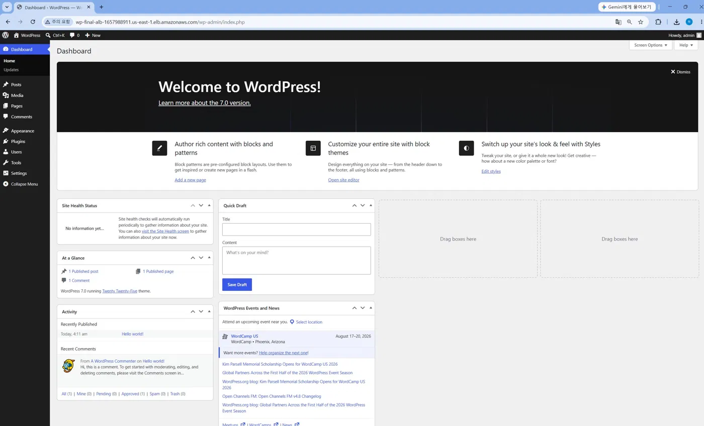

**EC2 Instance — IAM Role: LabRole, ASG: wp-final-asg**
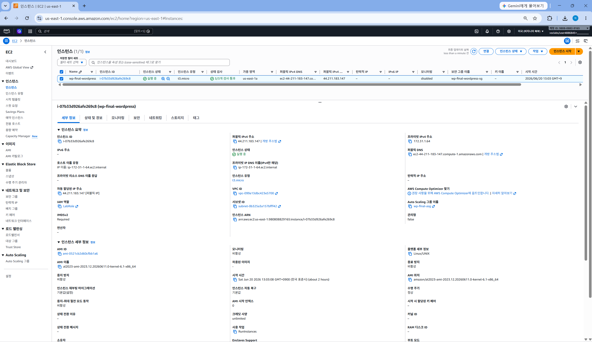

**Auto Scaling Group — wp-final-asg (min=1, desired=2, max=3, 2개 AZ)**
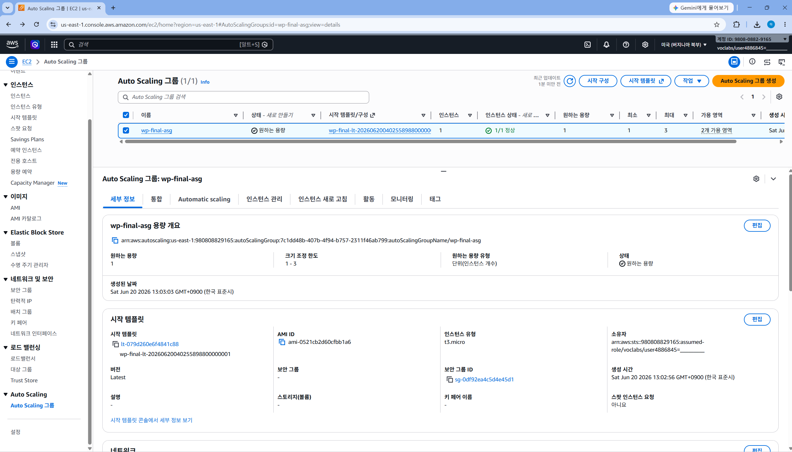

**Application Load Balancer — wp-final-alb (활성, us-east-1a + us-east-1b)**
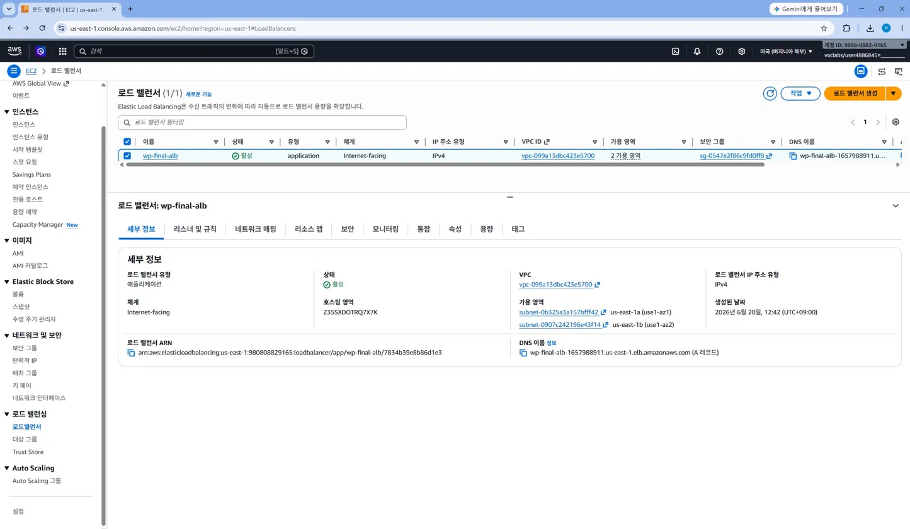

**ALB Target Group — i-07b33d926afe269c8 Healthy**
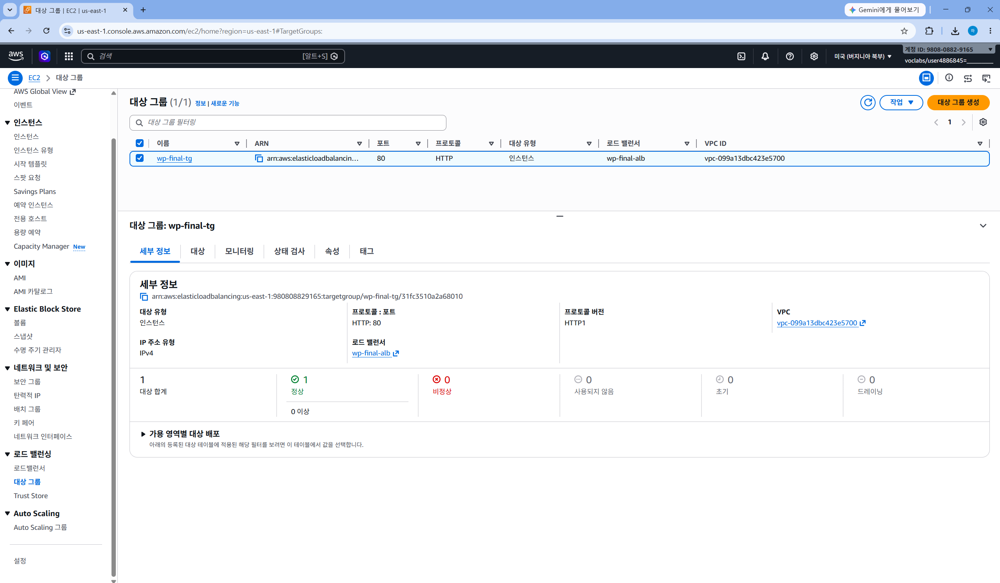

**RDS MySQL Multi-AZ — publicly_accessible: false, Standby: us-east-1b**
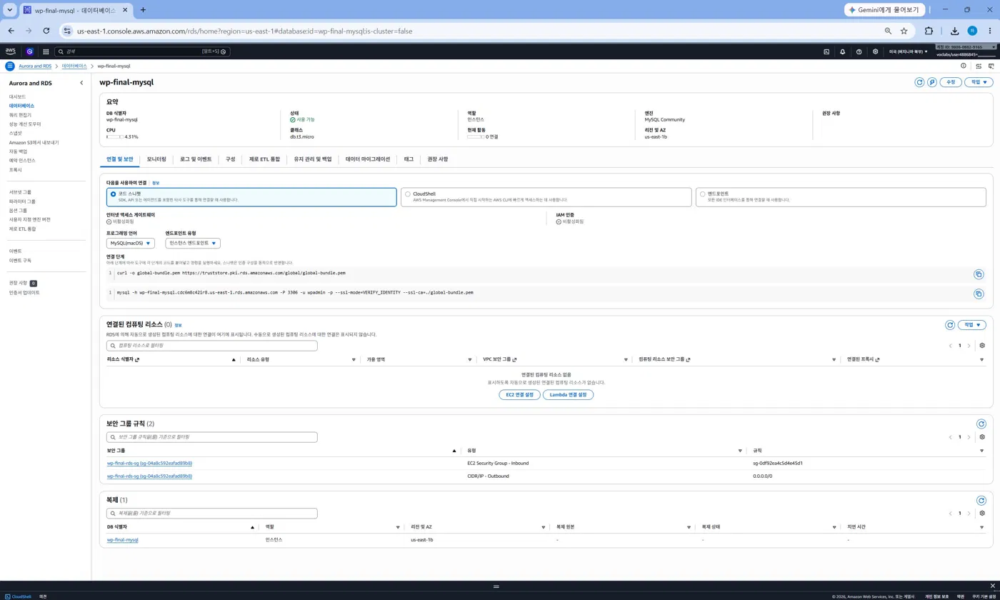

**S3 Bucket — wp-final-media-980808829165 (wp-content/ 폴더)**
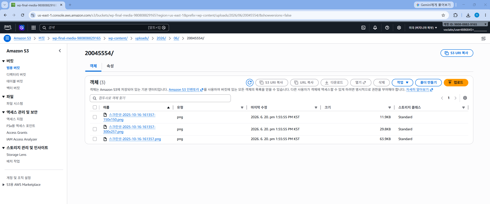

**WordPress Media Library — S3 URL로 서빙되는 미디어 파일 목록**
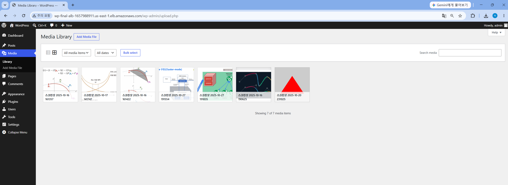

**WP Offload Media — Storage Provider: Amazon S3, Bucket, File URL 확인**
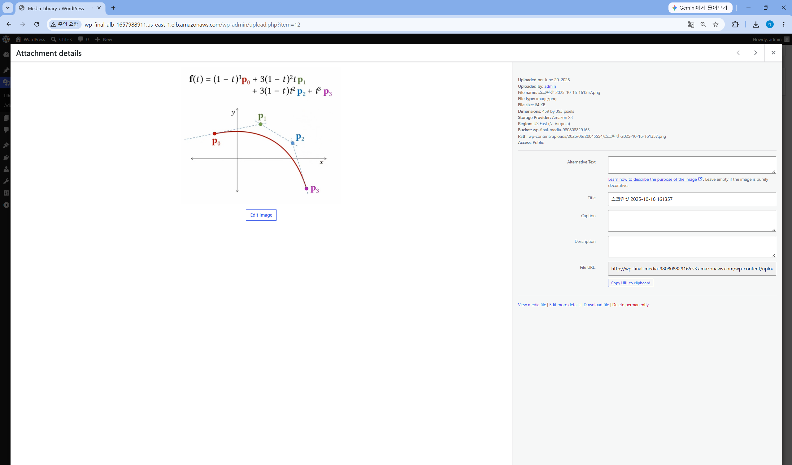

**CloudWatch Dashboard — 벤치마크 트래픽 실시간 반영 (7개 위젯)**
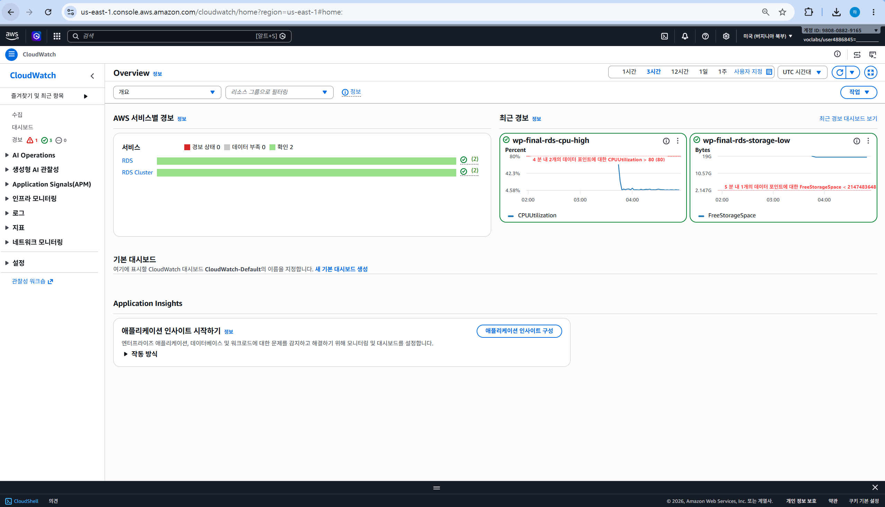

**CloudWatch Alarms — RDS CPU > 80%, RDS Storage < 2GiB 경보**
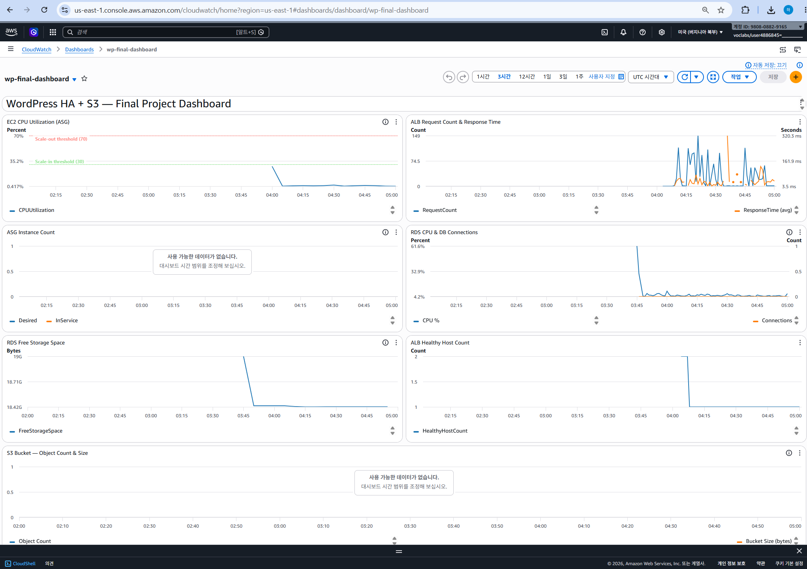

---

## 9. HA Failure Scenarios

### 9.1 EC2 인스턴스 장애
1. ALB 헬스체크(`GET /health.html → 200`) 3회 연속 실패 (약 90초)
2. ALB가 해당 인스턴스로 트래픽 전송 중단
3. ASG가 비정상 인스턴스 감지 후 종료 및 신규 인스턴스 시작
4. 신규 인스턴스 bootstrap 완료 후 ALB 등록
5. **사용자 체감 다운타임: 0초** (다른 AZ 인스턴스가 서비스 지속)
6. 신규 인스턴스도 동일 S3 버킷 접근 → 미디어 파일 보존

### 9.2 AZ 전체 장애
1. ALB가 장애 AZ 타겟 제거 → 정상 AZ로 트래픽 집중
2. RDS Multi-AZ Failover: Standby(us-east-1b) → Primary 승격 (60~120초)
3. S3는 리전(us-east-1) 서비스 → AZ 장애와 무관하게 가용
4. **예상 다운타임: 60~120초** (RDS Failover 시간)

### 9.3 미디어 파일 내구성

| 저장소 | 내구성 | 가용성 |
|---|---|---|
| EC2 로컬 디스크 | 인스턴스 종료 시 손실 | 단일 인스턴스 의존 |
| S3 Standard | 99.999999999% (11-nine) | 99.99% (리전 내) |

---

## 10. Remaining Limitations

| 한계 | 영향 | 향후 개선 |
|---|---|---|
| HTTP only (HTTPS 미지원) | 관리자 비밀번호 평문 전송 | ACM 인증서 + ALB HTTPS 리스너 |
| WordPress 코어 파일 EC2별 별도 존재 | 버전 불일치 가능성 | EFS 공유 마운트 |
| 단일 리전 배포 | 리전 장애 시 전체 서비스 중단 | Route 53 + 멀티 리전 Standby |
| C=40 응답시간 1.8초 | 사용자 경험 저하 | 인스턴스 타입 업그레이드 또는 스케일아웃 |
| S3 플러그인 수동 설정 필요 | 신규 인스턴스 자동화 불완전 | user-data.sh 자동화 개선 |

---

## 11. Conclusion

본 프로젝트에서 수업 Week 1~12의 모든 핵심 개념을 단일 HA WordPress 서비스로 통합 구현하였다.

Assignment 6에서 PDF가 "미해결"로 명시한 **공유 파일 스토리지 문제를 S3 Offload로 해결**하였고, 수업에서 배운 Benchmarking(Week 8)과 CloudWatch(Week 9~10)를 연계하여 "부하 테스트 → 메트릭 변화 → 운영 판단"의 흐름을 실제로 검증하였다.

Terraform으로 25개 리소스를 코드 한 번으로 배포하고, `terraform destroy`로 완전히 정리하는 IaC 기반 운영 패턴을 실현하였다. 이는 수업에서 강조한 "reproducibility(재현 가능성)"의 핵심 가치를 실무 수준으로 구현한 것이다.
